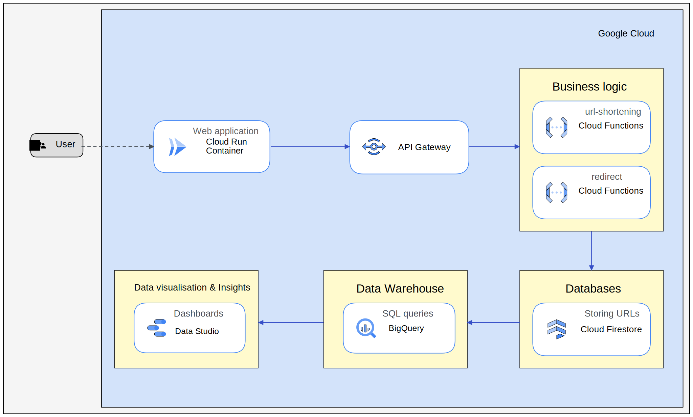

# url-shortener

Welcome to the 'Introduction to Cloud Computing' lab exercise of bejdenn.

For this project, bejdenn implements a URL shortener using the [Go][go] programming language.

## What is a URL shortener?

A URL shortener is pretty basic application. Its task is to provide a shortened URL for a longer one. If the user
eventually visits the shorter URL, he or she will be redirected to the webpage of the longer URL - so it is like making
a kind of alias for a desired URL.

## What makes your implementation special?

My URL shortener will be implemented completely in the cloud. The cloud service provider that had been assigned to me
is Google Cloud.

## How is the cloud integrated into the application?

For this project, 5 or more cloud services are necessary. Currently, I'm using these:

- Cloud Run
- Cloud Functions
- Firestore
- Big Query
- API Gateway
- Data Studio

## Architecture

[go]: https://go.dev/
